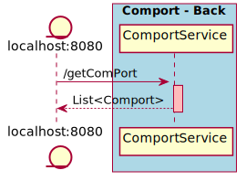

# ComPortManager

Caracteristicas:
- Integracion con ComPort---Front
- Listado de comports con localhost:8080/getComPort
- Funciones de openPort (con thead que imprime en consola el InputStream) y closePort

Mejoras Posibles:
- Agregado de funcion getInputStream
- Fix de error. An internal error occurred during: "Ready state poller". java.lang.NullPointerException

## Diagramas
Secuencia:

